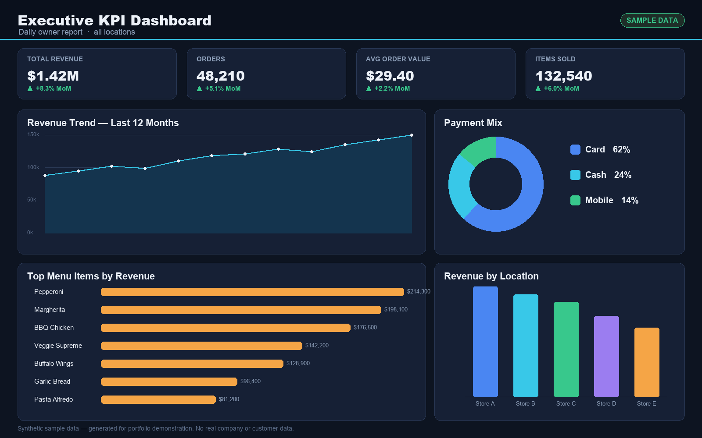
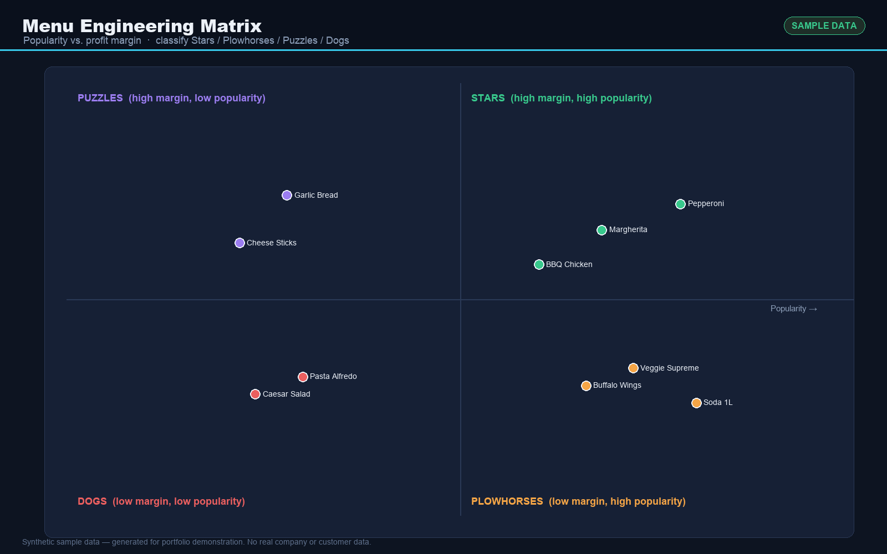
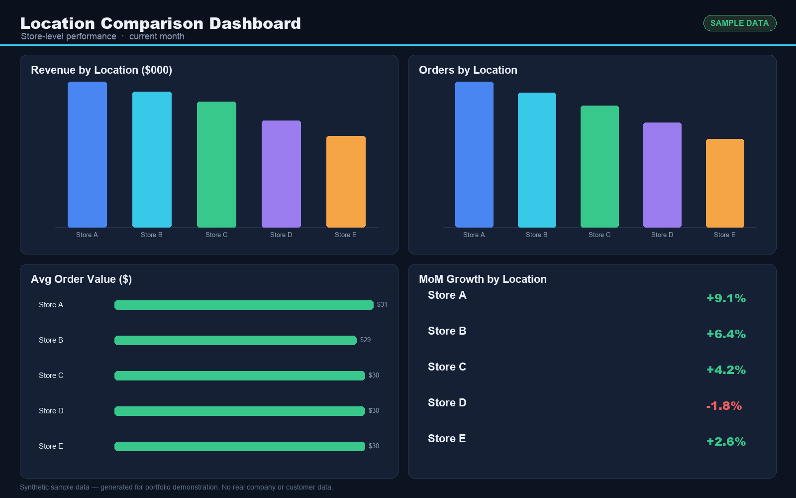
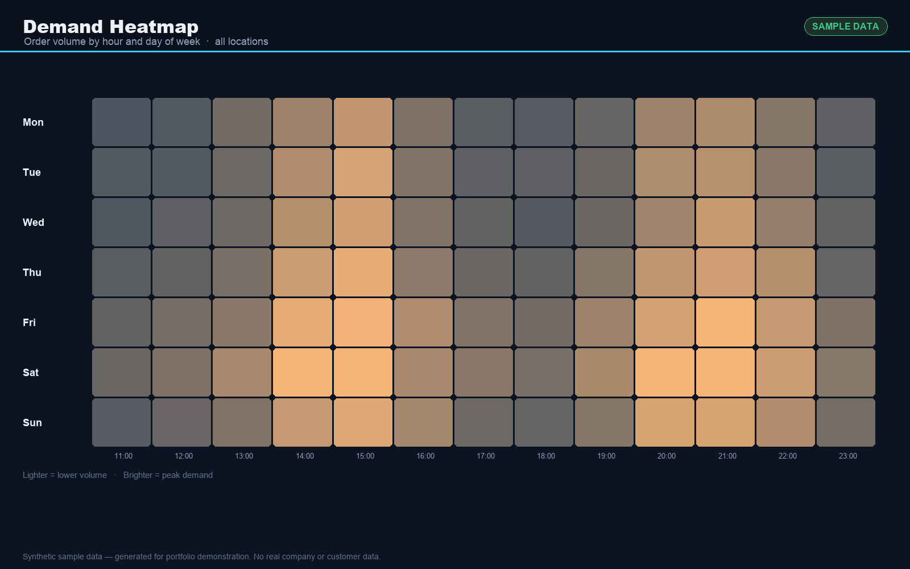
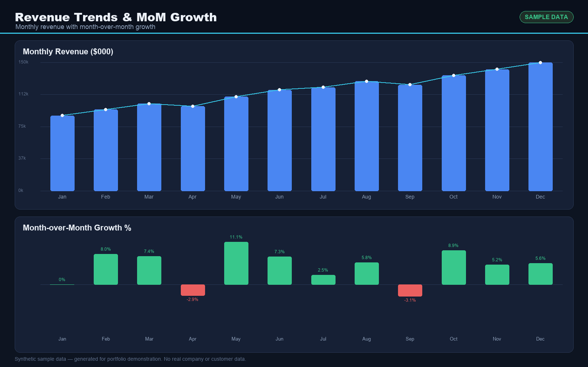
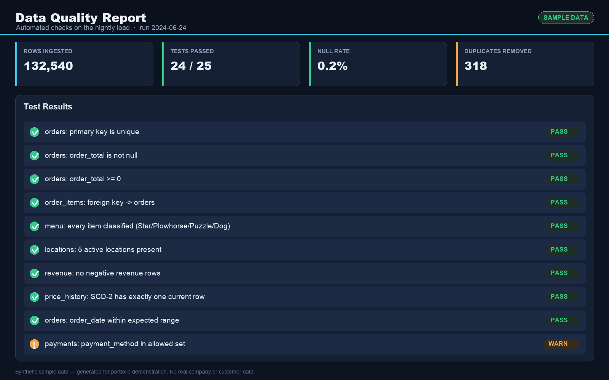
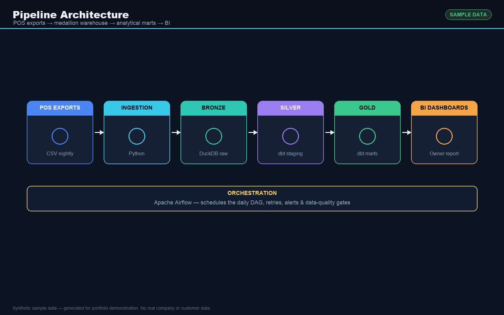
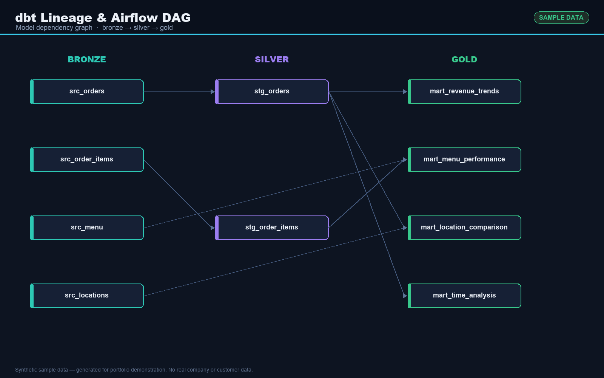

# Multi-Location Restaurant Analytics Pipeline

A production-style batch data pipeline that turns nightly POS exports from a multi-location
restaurant business into clean, analytics-ready marts and a daily owner report.

> Portfolio project. Built to demonstrate my data-engineering approach. This repository
> contains no real company or customer data — it runs on synthetic/sample data.

## Business Problem
A multi-location restaurant operator needed visibility into:
- Which menu items are actually profitable vs. just popular
- How each location performs month-over-month
- When peak demand occurs by hour and day
- How historical price changes affect margins (SCD Type 2)

## Architecture
POS exports (CSV) -> ingestion (Python) -> Bronze (DuckDB) -> dbt medallion models
(Bronze -> Silver -> Gold) -> Gold analytical marts -> daily owner report.
Orchestrated with Apache Airflow.

## Stack
Python / SQL / dbt / DuckDB / Apache Airflow

## Project Structure
- code/ — ingestion, transformation, validation
- dbt_restaurant/ — medallion models (bronze / silver / gold), tests, macros
- airflow/dags/ — daily orchestration DAG
- .env.example — environment configuration template

## Data
Sample/synthetic data only. Real data paths (data/raw/, *.duckdb) are git-ignored and never committed.

## Dashboards (sample data)
Generated on synthetic sample data to demonstrate the analytics layer — no real company or customer data.

| Executive KPIs | Menu Engineering |
|---|---|
|  |  |
| **Location Comparison** | **Demand Heatmap** |
|  |  |
| **Revenue Trends & MoM Growth** | **Data Quality Report** |
|  |  |
| **Pipeline Architecture** | **dbt Lineage & Airflow DAG** |
|  |  |
